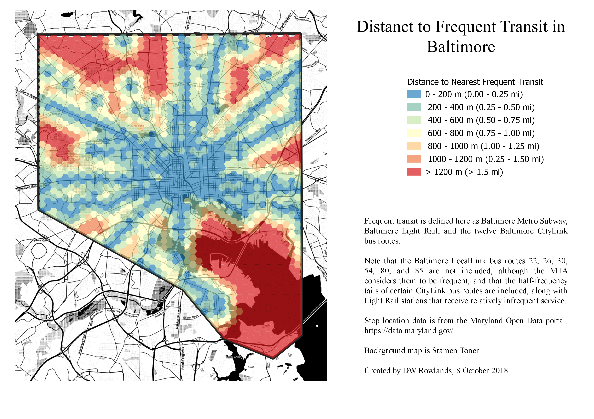

For my first GES 687 project, I decided to look at the relationship between the value of real property in Baltimore City and distance from frequent transit service.


[A 3D map of of Baltimore City.  Elevation represents distance from a frequent transit stop and is 1:1 with horizontal distance.  Color represents value per square meter of private real property lots, with bluer colors indicating higher values.](3D-Map.png)

While there was unfortunately not time to conduct a full statistical analysis, it appears that the distance to frequent transit is not clearly connected to property values in Baltimore City.

Unsurprisingly, frequent transit is most available in the downtown core, where many bus lines converge with the Baltimore Light Rail and Baltimore Metro Subway.  This area also has some of the highest property values in the city.  However, the relationship between frequent transit and property values is much less consistent in the outer areas of the city.

The corridors followed by the subway and light rail to the northwest and south of downtown have access to frequent and fast transit to downtown.  However, the property values in these areas are low by Baltimore standards, while nearby areas with worse transit access have higher property values.

Still, those areas of the city which are furthest from frequent transit do appear to generally have quite low property values.

## Property Values from the Baltimore Real Property Database

Real property values for privately-held lots in Baltimore City were mapped based on data from the [Baltimore Real Property Database](http://gis-baltimore.opendata.arcgis.com/datasets/real-property).  Estimated current cash values of land and improvements per square meter of lot size were calculated for each lot.

Lots listed in the database as being owned by some variant on "State of Maryland" or "Mayor and City Council of Baltimore" were excluded.  These lots were dropped because they were generally public property with essentially meaningless estimated values: many large and valuable lots belonging to the city or state were listed with estimated values of $0 or $100.

Notably, lots belonging to the [Housing Authority of Baltimore](http://www.baltimorehousing.org/), which had a listed owner of "Housing Authority", were included, since they were generally given plausible estimated values, presumably since—unlike parks or government offices—they can be compared to nearby private property with similar uses.


[Cash values per square meter for land and improvements on privately-owned lots in Baltimore City.](PropertyValues.pdf)

To extract the cash values and lot areas of privately-owned lots, [a SpatiaLite query](PropertyValueQuery.PNG) was used.  Cash value was calculated as the sum of four columns in the database:
+ `currland`, the current not-tax-exempt cash value of the lot's land
+ `currimpr`, the current not-tax-exempt cash value of the lot's improvements and structures
+ `exmpland`, the current tax-exempt cash value of the lot's land
+ `exmpimpr`, the current tax-exempt cash value of the lot's improvements and structures

As several spellings and formattings were used in the names of publically owned lots, all lots with a `owner_1` column starting `"STATE OF MARYLAND"` or of the form `"MAYOR"[wildcard]"CITY COUNCIL"[wildcard]` were excluded.

## Frequent Transit in Baltimore

To map distance from frequent transit, Baltimore was divided into a 400-m-by-400-m hex grid and the distance from the centroid of each hex to the nearest light rail or subway station or bus stop served by CityLink buses (which have 24-7 service and headways not greater than every 15 minutes during the day on weekdays) was measured.


[Distance to nearest transit stop with frequent service (defined as light rail, subway, or "CityLink" bus) in Baltimore City.  Hexes form a roughly quarter-mile grid.](DistanceToTransit.pdf)

The locations of rail stations and bus stops were taken from shapefiles provided by the [Maryland Open Data Portal](https://data.maryland.gov).  (Specific links can be found below under Data Sources.)

### Identifying CityLink Bus Stops

Since the bus stop shapefile included all Maryland Transit Administration (MTA) bus routes in the state, including infrequent Baltimore-area routes and long-distance commuter bus routes, [a SpatiaLite query](CityLinkQuery) was used to extract only those stops served by one of the twelve CityLink routes.

Unfortunately, since several CityLink routes have multiple lower-frequency branches that use the same route number, it was impossible to remove these lower-frequency stations from the dataset.  However, most—though not all—of these branches are in the suburbs, so the effect of this within Baltimore City should be limited.

### Mapping Distance to Transit

Once the bus stops and rail stations with frequent service had been identified, the QGIS algorithm `Distance to Nearest Hub (Points)` was used to find the distance from the centroid of each hex to the nearest stop or station in meters.

Hexes were then colored based on this distance value to produce the 2D map of distance to frequent transit.  In order use this distance information for elevation in the 3D map, the distance values were converted to a raster.

## List of Data Sources

+ [Baltimore Real Property Database](http://gis-baltimore.opendata.arcgis.com/datasets/real-property)
+ [MTA Balimore Link System Map](http://www.baltimorelink.com/images/maps/system_map/BaltimoreLink%20System%20Map.pdf)
+ Transit Shapefiles from the [Maryland Open Data Portal](https://data.maryland.gov)
    + [Baltimore Light Rail Stops](https://data.maryland.gov/Transportation/MD-iMAP-Maryland-Transit-Light-Rail-Stops/hy7n-2p4b)
    + [Baltimore Light Rail Lines](https://data.maryland.gov/Transportation/MD-iMAP-Maryland-Transit-Light-Rail-Lines/c2sx-usxs)
    + [Baltimore Metro Subway Stops](https://data.maryland.gov/Transportation/MD-iMAP-Maryland-Transit-Baltimore-Metro-Subway-St/958k-rqgi)
    + [Baltimore Metro Subway Lines](https://data.maryland.gov/Transportation/MD-iMAP-Maryland-Transit-Baltimore-Metro-Subway-Li/ykwh-r4a8)
    + [MTA Bus Stops (including Baltimore)](https://data.maryland.gov/Transportation/MD-iMAP-Maryland-Transit-MTA-Bus-Stops/j2zf-ej96)
    + [MTA Bus Lines (including Baltimore)](https://data.maryland.gov/Transportation/MD-iMAP-Maryland-Transit-MTA-Bus-Lines/xmhu-zntx)
+ [Stamen Toner Basemap](http://maps.stamen.com/toner-background/#13/39.2975/-76.6149)

## Tools Used

All data processing and map production was done using QGIS 3.2.3-Bonn with SpatiaLite 4.3.0.

The QGIS algorithms `Distance to Nearest Hub (Points)`, `Refactor Fields`, `Create Grid`, and `Centroids` were used in data processing.

### SpatiaLite Query for Property Values

Cash property values per square meter for property other than certain publicly owned properties were extracted from the Baltimore Real Property Database with the SpatiaLite query ([See Screenshot](PropertyValueQuery.PNG)):
````
select r.objectid, r.zonecode, r.owner_1,
  ifnull(r.currland,0)+
    ifnull(r.currimpr,0)+
    ifnull(r.exmpland,0)+
    ifnull(r.exmpimpr,0)
    as "cash_val",
  st_area(r.geometry,1) as "lot_area_m2",
  (ifnull(r.currland,0)+
    ifnull(r.currimpr,0)+
    ifnull(r.exmpland,0)+
    ifnull(r.exmpimpr,0))
    /st_area(r.geometry,1)
    as "value/m2",
  taxbase, r.geometry
from real_property as r
where
	r.owner_1 NOT LIKE 'STATE OF MARYLAND%' AND
	r.owner_1 NOT LIKE 'MAYOR%CITY COUNCIL%'
````

### SpatiaLite Query for CityLink Bus Stops

Bus stops served by Baltimore CityLink routes were extracted from the Maryland Open Data Portal's MTA bus routes shapefile with the SpatiaLite query  ([See Screenshot](CityLinkQuery.PNG)):
````
select ogc_fid,
  objectid,
  routes_ser,
  geometry
from bus_stops
where
  routes_ser like '%BR%' or
  routes_ser like '%RD%' or
  routes_ser like '%PK%' or
  routes_ser like '%OR%' or
  routes_ser like '%GD%' or
  routes_ser like '%YW%' or
  routes_ser like '%LM%' or
  routes_ser like '%GR%' or
  routes_ser like '%BL%' or
  routes_ser like '%NV%' or
  routes_ser like '%PR%' or
  routes_ser like '%SV%'
````
