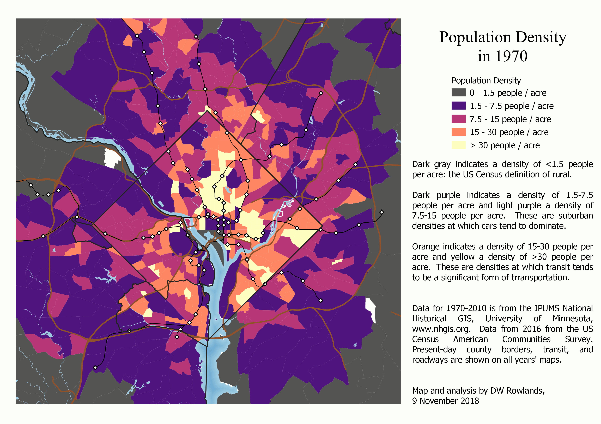
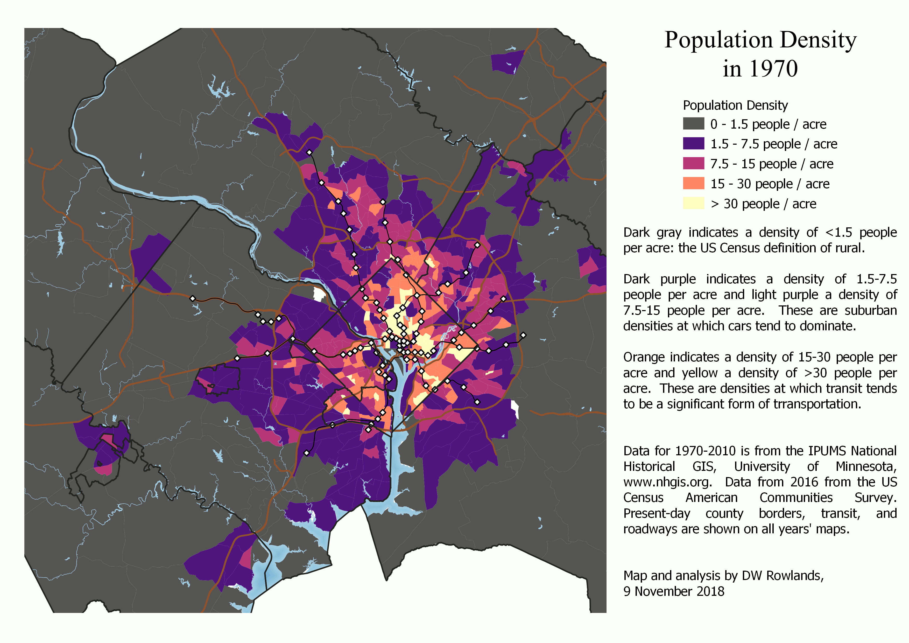
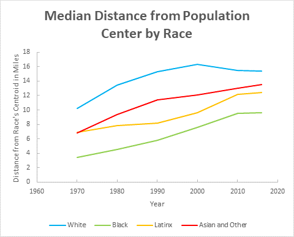

---
title: Population Distribution and Race
--- 

For my second GES 687 project, I decided to look at how population distribution and density have changed in the Washington, DC metro area over the past half-century.

Using historical population data by Census tract for the five US Decennial Censuses 1970-2010 from the [IPUMS National Historical GIS project of the University of Minnesota](www.nhgis.org), I mapped the population densities of Census tracts in the DC metro area for each year between 1970 and 2010.

[How the population density of the DC metro area has changed over](Density-Beltway.gif) the years [1970](Density-Beltway-1970.pdf), [1980](Density-Beltway-1980.pdf), [1990](Density-Beltway-1990.pdf), [2000](Density-Beltway-2000.pdf), and [2010](Density-Beltway-2010.gif).

Even in 1970, there was a clear directional bias toward suburban growth: in Prince George's County land outside the Beltway was nearly all still rural, while significant development outside the Beltway had begun in Montgomery and Fairfax Counties.

Over the forty-year period shown in the density maps, inner suburban desnities did increase, though rarely to levels where car-dependence breaks down.  However, the lower-density inner suburbs were replaced by a rapidly growing swath of low-density suburbs further and further outside the Beltway.

[How the population density of the DC metro area has changed over](Density-Large.gif) the years [1970](Density-Large-1970.pdf), [1980](Density-Large-1980.pdf), [1990](Density-Large-1990.pdf), [2000](Density-Large-2000.pdf), and [2010](Density-Large-2010.gif).

In addition, to study the differences in population distribution between different racial groups, I used the same data plus population figures by Census tract from the 2016 [American Community Survey](https://www.census.gov/programs-surveys/acs), to map the population density of Census tracts and the distribution of different racial and ethnic groups over forty-six years.

### Choosing a Study Region

Choosing the region to be analyzed for this project was somewhat difficult.  A naive solution would be to use the Census's current definition of the [Washington-Arlington-Alexandria Metropolitan Statistical Area](https://en.wikipedia.org/wiki/Washington_metropolitan_area).  However, this is not a viable option due to the constraints of available data and of the asymmetrically-shaped MSA.

#### Constraining Factors

First, the Washington, DC MSA is very asymmetrically shaped, because its northeastern border is constrained by the Baltimore MSA, which it borders less than twenty miles from downtown DC, while it extends over fifty miles to the south and west.

Assuming that DC's commuter zone stops at the Patuxent River merely because that is the boundary of the MSA is frankly absurd.  At the same time, including the whole Baltimore MSA (which is included in [the same Combined Statistical Area as Washington](https://en.wikipedia.org/wiki/Baltimore%E2%80%93Washington_metropolitan_area)) would cause changes in the relative populations of the two urban areas to swamp any changes in the distribution of residents of the DC area.

Second, and perhaps even more constraining, Census tracts were not defined for all counties in the US until the 2000 Census.  The reason I decided to start this study in 1970 is that that was the first year that suburban counties in the DC area, besides Arlington County, VA and the City of Alexandria, VA were divided into Census tracts.  However, Charles County, MD was not divided into Census tracts until 1980, though it comes relatively close to the southern border of DC.

#### Final Choice of Region

In order to have a consistent region for all years, I decided to limit myself to counties that had already been divided into Census tracts in 1970.  Within the Washington, DC MSA, this gave me:

- the District of Columbia
- in Maryland:
  - Prince George's County
  - Montgomery County
- In Virginia:
  - Arlington County
  - the City of Alexandria
  - Fairfax County
  - the City of Fairfax
  - the City of Falls Church
  - Loudoun County
  - Prince William County
  - the City of Manassas
  - the City of Manassas Park

In addition to these jurisdictions, I decided to also include Howard and Anne Arundel Counties in Maryland, because [a significant fraction (roughly a quarter) of their employed residents work in the DC metro area DC](https://www.dcpolicycenter.org/publications/how-many-people-commute-between-baltimore-and-d-c/), and because they are as close to downtown DC as some of the Virginia jurisdictions included.

### Mapping Population Distribution by Race

The first step toward understanding how the DC metro area's population distribution of different races had changed during the study period was to map the distribution of residents of different races.  Since the US Census has been inconsistent in how it reports data on race and ethnicity (Latinx / non-Latinx status) over the study period, I developed a consistent classification to use for my maps.  I then made dot maps of the population distribution in each year studied, with dots color-coded by race, to help visualize this information.

#### Classifying Census Respondents' Race

For the purposes of this study, I decided to divide the population of the study area into four racial groups: non-Latinx white, non-Latinx African-American, Latinx of any race, and non-Latinx Asian/Other.  The decision to group non-Latinx Census respondents who identified as Asian-American, Native American, Pacific Islander, "Other Race," or more than one race together was made for two reasons:

First, the study area population is largely white, African-American, and Latinx, with a small Asian-American minority: the number of respondents who identified themselves outside of these groups was very small.  Second, in some years, the available data either lumped together Asian-American and Native American respondents, or else Asian-American and "Other Race" respondents.

Since data on the populations of Latinx and non-Latinx Americans by race was not available from the 1970 Decennial Census, though a total Latinx population was, I used the total African-American and Asian/Other populations for 1970.  I approximated the non-Latinx white population in 1970 as the total white population minus the total Latinx population, since in later years, the vast majority of the study region's Latinx population seems to have identified as white.  Since the total Latinx population in the study area was quite small in 1970, this should not seriously interfere with the analysis.

#### Dot Maps of Population Distribution by Race

To visualize the distribution of population by race over time in the study region, I made dot maps of the population, color-coded by race.  Dots were randomly located within each Census tract, with one dot for every ten residents.  Using one dot per ten residents rather than one dot per resident prevented the densest parts of the region from exceeding a maximum dot density at which point additional dots would necessarily cover the dots behind them.

Maps were created for [1970](Dotmaps-Large-1970.pdf), [1980](Dotmaps-Large-1980.pdf), [1990](Dotmaps-Large-1990.pdf), [2000](Dotmaps-Large-2000.pdf), [2010](Dotmaps-Large-2010.pdf), and [2016](Dotmaps-Large-2016.pdf), and a color code of blue for whites, green for African-Americans, orange for Latinx, and red for Asian-Americans (and others) was used.

[Map of the population distribution inside the DC Beltway, 1970-2016.  One dot per ten residents, colored blue for whites, green for African-Americans, orange for Latinx, and red for Asian-Americans (and others).  The large dots are the center-of-population for each racial group within the study region.](Dotmaps-Beltway.gif)

A view of the area inside the Beltway—where most residents were still concentrated in 1970—shows that in 1970, minority populations were nearly entirely located inside the borders of the District of Columbia.  The only minority population visible on the 1970 map is African-Americans.  Other than a small African-American neighborhood in Old Town Alexandria that dates back to an Antebellum free African-American community and another one in south Arlington, the only visible African-American population in 1970 outside of the District is in a small swath of Prince George's County inside the Beltway and between US-50 and Central Avenue.  Within the District, African-Americans dominated essentially the entire area east of 16th Street in 1970.

Over the course of the study period, the African-American population in the District becomes less dense, particularly northwest of the Anacostia River, while Prince George's County south of US-50 becomes nearly entirely African-American, and African-Americans become substantially more common in northern Prince George's and eastern Montgomery Counties.

[Map of the population distribution in the DC metro area, 1970-2016.  One dot per ten residents, colored blue for whites, green for African-Americans, orange for Latinx, and red for Asian-Americans (and others).  The large dots are the center-of-population for each racial group within the study region.](Dotmaps-Large.gif)

Other racial minority communities also develop over the course of the study period: in 1990, substantial Latinx populations become visible in Columbia Heights in the District and Langley Park in Maryland.  It is notable that the Columbia Heights area transitions from African-American to Latinx, while the Langley Park area appears to have been entirely white before transitioning to Latinx.  Other Latinx populations develop over the course of the 1990's and 2000's, and although Latinx residents still appear to mostly be clustered in ethnic enclaves, these are found nearly everywhere in the suburbs except for Prince George's County south of US-50 and the rich, low-density areas along the Potomac River northwest of the District.

Identifiable Asian-American enclaves start to appear in Fairfax County in the 1990 Census, and by the 2000 Census, they are found throughout Fairfax and Montgomery Counties and in parts of Arlington.  Interestingly, a significant number of Asian-American residents appear in downtown DC in 2000.  The only other group to increase its presence in the District in the 2000's and 2010's is whites, who begin to expand into Capitol Hill starting with the 1990 Census and into the Mid-City in the 2000 and 2016 data.

### Analyzing Changes in Racial Population Distribution

A visual analysis of population dot maps can only tell us so much about the distributions of different populations, and risks introduction of bias due to biases in human visual perception.  To supplement this analysis, I also performed a relatively simple mathematical analysis of the population data, determining the movement of the centers-of-population for each race and median distance of residents of each race from their race's center of population.

#### Movement of Racial Centers-of-Population

The population centers were calculated for each racial group in each year by finding the center of mass for each race's distribution of random dots.  While this does introduce a potential element of randomness, the number of dots in each Census tract is quite large, making the exact location of individual dots unlikely to substantially bias the results.

These centers of mass were plotted on the appropriate maps with large dots of the same colors, allowing one to track their movement between years.  Surprisingly, the white, Asian-American, and Latinx centers all behaved very similarly to each other, while the motion of the African-American center was completely different.

In 1970, the African-American population center was located in Northeast DC, roughly at the site of the US National Arboretum.  It stayed in this area until the 2010 Census, at which point it moved to very near the Brookland-CUA Metrorail station, where it remained in 2016.

This slight northwestern movement is somewhat surprising, given the massive movement of African-Americans (both from within the region and around the country) to southern and central Prince George's County during the study period as a whole, and the replacement of many African-American residents of the Mid-City with residents of other races during this time.  It indicates that there was also a significant increase in the African-American populations of the western and northern suburbs (and northern Anne Arundel County) that is less visible on the maps than the suburban population in Prince George's County because these areas are more integrated than the southern Prince George's neighborhoods, which are often 90% or more African-American.

The population centers for other races were all significantly to the west of that for African-Americans in 1970.  The white population center in that year was in DC, just north of the Old Soldiers' Home, and near the triple-boundary with Prince George's and Montgomery Counties.  The Asian-American and Latinx population centers were located slightly to the south, just east of Columbia Heights.

In the years between 1970 and 2016, the three non-African-American groups' population centers all moved to the west-northwest in almost the exact same direction and, through 2000, at nearly the exact same rate.

By the 2000 Census—when the African-American population center was still located in the vicinity of the National Arboretum—the other three population centers were located along the northwestern border of the District of Columbia.  The Latinx population center was located on the Potomac River just inside the District boundary, while the white population center was located just outside the District near the Friendship Heights Metrorail station, and the Asian-American population Center was located on the Potomac River just outside the District boundary.

After 2000, the movements of these population centers changed: rather than continuing to move northwestward, the Latinx and white population centers stayed in nearly the same location through 2016, with the white center even moving slightly _east_ between 2000 and 2016.

The Asian-American population center, however, continued on the same trajectory and reached the vicinity of the American Legion Bridge by 2010.  It then also moved slightly to the east by 2016.

#### Degrees of Suburbanization by Race

While the movement of the non-African-American population centers to the northwestern suburbs demonstrates that a majority of these groups' population is now suburban, it doesn't give a clear picture of how concentrated the populations are.

To better quantify this information, I calculated and plotted the median distance members of each racial group within the study area lived from the racial group's center of mass.

[Plot of the median distance a resident of each race lived from their race's population center](Median_Distance_Over_Time.gif) in [1970](Distribution_1970.gif), [1980](Distribution_1980.gif), [1990](Distribution_1990.gif), [2000](Distribution_2000.gif), [2010](Distribution_2010.gif), and [2016](Distribution_2016.gif).

As expected, the African-American community was the most tightly clustered: in 1970, half of African-Americans in the study area lived within 4 miles of the African-American population center.  This increased steadily at a rate of just over a mile a decade for forty years, leveling off at 9 miles in 2010 and 2016.  Even in 2016, though, the African-American population had a lower median distance than the white population did when it was most clustered, in 1970.

The Latinx and Asian-American populations' median distances from their population centers increased by roughly the same amount during the study period: both had median distances of 7 miles in 1970 and roughly 12 miles in 2016.  However, while the Asian-American median distance increased steadily during that time, the Latinx median distance grew quite slowly until 1990 and significantly more quickly afterward.

Meanwhile, the white population suburbanized even more rapidly, with the median distance from the population center increasing from 10 miles in 1970 to 16 miles in 2000: a rate of two miles a year.  However, after 2000, this distance actually decreased somewhat, reaching 15 miles by 2016.

### List of Data Sources

- Population data and shapefiles for the 1970-2010 Decennial Censuses were obtained from the [IPUMS National Historical Geographic Information System at the University of Minnesota](https://nhgis.org/).
- Population data for the 2016 American Community Survey was taken from the US Census's [American Fact Finder](https://factfinder.census.gov/faces/nav/jsf/pages/index.xhtml?).
- The 2010 Census tract shapefiles and water and road network shapefiles were taken from the US Census's [Tiger/Line shapefile repository](https://www.census.gov/geo/maps-data/data/tiger-line.html).
- The WMATA Metrorail lines and stations shapefiles are from the [Maryland iMAP data portal](https://imap.maryland.gov/Pages/default.aspx).

All data processing and map production was done using QGIS 3.2.3-Bonn.
