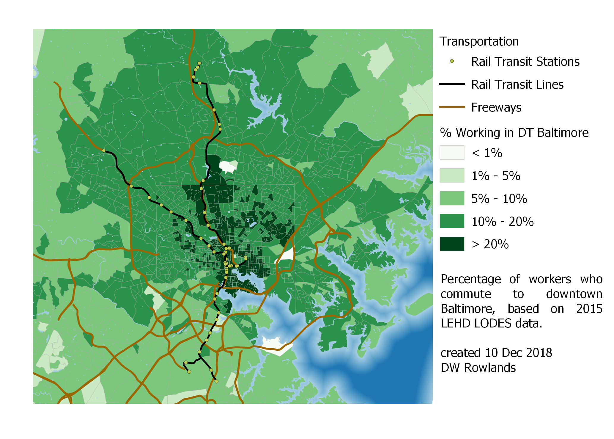
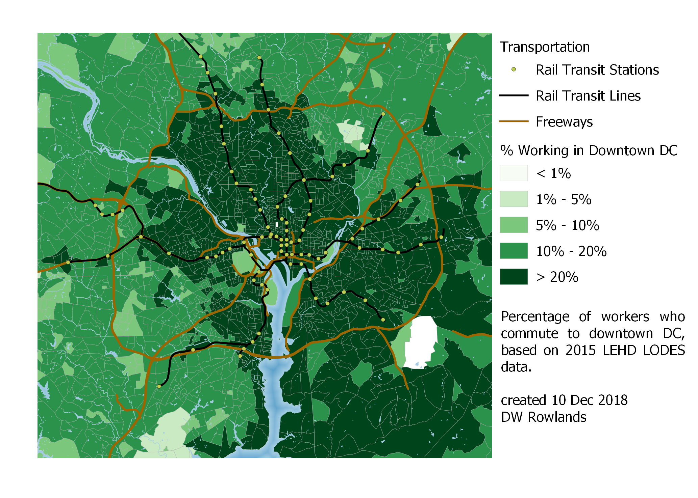

## 1 - Mapping Job Density

The most common way to map the density of urban areas is to map their population density.  This is easily done, since essentially all national governments perform regular censuses that record the number of residents within relatively small tracts covering the whole country.

While population density is an important metric, it is not the only useful way to evaluate the density of urban areas.  For some purposes, the density of jobs is more important than population density.  For example, in many cases, local governments get an outsized proportion of their tax revenue from commercial uses, both due to higher property tax rates and land values and because of sales and corporate taxes and income being taxed where it is earned rather than where the earner resides.

In addition, the highest job densities in an area will usually be higher than the high end of residential densities, and the most transit ridership and transportation congestion will be found in these areas of densely clustered jobs.

While the US Census does not directly ask residents where they work, it does put out data products on employment based on data it acquires from other Federal and state government agencies.  The Longitudinal Employer-Housing Dynamics program's [LEHD Origin-Destination Employment Statistics (LODES)](https://lehd.ces.census.gov/data/) reports the location of each job and worker covered by state unemployment compensation programs, as well as most Federal jobs.  (Not all Federal jobs are included: military and some security-related civillian jobs are omitted.)

For the purpose of mapping job density, it was possible to partly correct for the omission of military and security-related civillian jobs.  As detailed in Section 1.5.3, The Census provides a shapefile of military bases and I was able to determine the approximate number of employees on most of these bases within the CSA.  I also was able to find the appxoimate number of employees in several of the larger DOD-related job sites not part of military bases.

The maps shown in this section include the job densities on these military bases and other work sites superimposed over the job densities by block group calculated from LODES data.

### 1.1 - Jobs in the Combined Statistical Area as a Whole

Census combined statistical areas are defined as collections of smaller "metropolitan statistical areas," each of which is intended to consist of a single major city (or pair of major cities, in some cases) with the suburban counties where a significant fraction of the population commutes to the central city.

Most combined statistical areas also consist of a single primary metropolitan statistical area, and several smaller ones with commuting links, particularly between outlying counties.  The Washington-Baltimore-Arlington CSA is unusual in containing two fairly-equally-sized metropolitan statistical areas, Washington (6 million residents) and Baltimore (3 million residents).  Alongside these, it contains six much smaller areas, typically consisting of only one or two counties, on its western fringe and the Delmarva Penninsula.


Job density in the Washington-Baltimore-Arlington Combined Statistical Area.  Some outlying portions of the CSA are cut off.

A look at the job density in the CSA as a whole shows that while there are some suburban-density job clusters on the outer reaches of the CSA, most of the jobs appear to be concentrated within the Baltimore and Washington Beltways, and in an arc to the west of Washington.


Job density in the core portions of the Washington-Baltimore-Arlington Combined Statistical Area.  Frederick is to the upper left, Baltimore to the upper right, and the sprawling Washington region is in the lower left and center.

A closer look shows that Baltimore and Washington are distinct from the smaller cities in the region in that they have significant and often quite dense suburban job closters.  In Baltimore's case, these are mostly within or just adjacent to its Beltway, although there are a number along MD-100 and MD-32, which serve as partial outer beltways for Baltimore on its southern end.

In Washington's case, the areas of high job density—many of them at levels of greater than 15 jobs per acre, a level at which transit service is viable—are far beyond the Beltway, and many are separated from the city by large areas with rural-level job densities.

### 1.2 - Jobs in Greater Baltimore

Although Baltimore's employment distribution is rather more compact than DC's, there are at least three easily-noticable job clusters outside of the city proper that are dense enough for potential transit service: Towson, at twelve-o'clock just inside the Beltway, Reisterstown Plaza along the Metro Subway line inside the Beltway at ten-o'clock, and White Marsh, just outside the Beltway and south of I-95 at two-o'clock.  However, of these, only Reisterstown Plaza is served by rail transit.


Job Density in Baltimore and its inner suburbs.

Other than these four main clusters, jobs in the Baltimore area seem to be mostly located along freeways—there are notably many commercial areas apparently located just inside and outside the Beltway—often with surprisingly large gaps of empty or entirely-residential land in between.

### 1.3 - Jobs in Greater Washington

The same pattern of suburban jobs primarily along freeways is seen in Washington as well, although there many jobs also seem to be located along transit lines.  While Washington has many more suburban job closters than Baltimore, it is notable that those in Arlington County, VA (the Ballston-Rosslyn Corridor and south Arlington's Crystal City and Pentagon City) and Montgomery County, Maryland (downtown Rockville, White Flint, Bethesda, Forest Glen, and Silver Spring) seem to be well-located along transit lines, while those in other suburbs often are not.


Also notable in Washington is the region's strong tendency for jobs not located in downtown to be located in the western suburbs.  Many more clusters of high-density jobs are seen in the western portion of Montgomery County and in Virginia—especially if you consider that this map cuts off the westernmost arc of jobs seen on the regional map—while relatively few are located east of downtown.

In comparison, Baltimore had less of a pronounced asymmetry in suburban job locations, although it is not entirely symmetrical.  (Baltimore does have more suburban jobs further out to the southwest in locations like Columbia, partly because, in this area, the two metro areas blend together.)

### 1.4 - Jobs in Smaller Cities

Along with the two major metropolitan areas of Washington and Baltimore, I mapped the job density in the vicinity of several smaller cities in the CSA.  Of these, Annapolis has the most jobs, in part because it is the state capital and many (though not all) state agencies are based there.


Job density in Annapolis, at the lower right of the map.  (Baltimore's southern suburbs are at the top of the map, and DC's eastern suburbs are at the left of the map.)

While Annapolis is a distinct city in its own right, and even has what appear to be a few outlying commercial areas near it in places such as Arnold, it is clearly relatively close to both Baltimore and Washington suburbs.  It actually appears to have two separate job clusters: a denser one in the old historic downtown to the east end of the city, and a less dense but larger one centered along US-50 west of the city proper.  However, in the analysis that follows, I will treat these together as a single cluster.

Annapolis has relatively limited bus transit and no fast, frequent transit connections to either Washington or Baltimore, but it does have several block groups with job concentrations above 15 jobs per acre, a level at which car-dependence generally breaks down if sufficient transit is supplied.  Along with the benefit of providing citizens of denser areas with transit connections to their state capital, this commercial density suggests that better transit service from Baltimore and Washington would be worth considering.

Like Annapolis, Frederick and Hagerstown are small cities in Maryland founded before the American Revolution.  However, located in the foothills of the Allegheny Mountains, they are more isolated from the large population centers in Baltimore and Annapolis, and they lack the additional jobs associated with being a state capital.


Job density in Hagerstown (upper left) and Frederick (lower right).

Both cities have smaller dense commercial cores: only their small historic downtowns have job density high enough to allow car-dependence to break down.  However, they do have significantly-sized contiguous areas of lower-density suburban jobs.


### 1.5 - Data Sources and Processing

The data analyzed in this project is from the US Census's Longitudinal Employer-Housing Dynamics program's [LEHD Origin-Destination Employment Statistics (LODES)](https://lehd.ces.census.gov/data/) data from 2015 (the most recent year available) for the [Washington-Baltimore-Arlington Combined Statistical Area](https://en.wikipedia.org/wiki/Baltimore%E2%80%93Washington_metropolitan_area).

Census 2018 [TIGER/Line](https://www.census.gov/geo/maps-data/data/tiger-line.html) shapefiles for Census block groups, military bases and water areas were used to produce the maps.

Using QGIS 3.4.2, I assembled the LEHD datasets from the states included in the Washington-Baltimore-Arlington Combined Statistical Area ("the CSA") and TIGER/Line block group shapefiles for the counties included in the CSA into single shapefiles.

#### 1.5.1 - Processing Water Features

Census block groups include both land and water area—sometimes significant water area—so, to produce a block group connectivity map that better reflects transportation connectivity, I decided to subtract off large water features from the block group shapefile before performing my analyses.

I downloaded Census 2018 TIGER/Line surface water shapefiles for each county in the CSA.  To make the difference operation take a reasonable amount of time on the computers available, all features under 1,000,000 m^2 were removed from the combined shapefile.

Once small features has been removed, I dissolved together all water features and subtracted the combined feature from the block group map to eliminate fictitious continuity across water boundaries.

#### 1.5.2 - Tabulating Jobs and Workers by Block Group

The Census reports LODES data tabulated by Census tabulation blocks, and provides crosswalk files to show which tabulation blocks are components of each larger geometry.

To produce a vector layer with numbers of jobs and workers in each Census block group, I combined the crosswalk files for the states included in the CSA into a single shapefile and loaded the combined crosswalk file, the combined jobs and workers data files, and the modified block group shapefile discussed above into a SpatiaLite SQL database.

Using the following SQL query, I created a new vector layer consisting of the block group geometry

- with the land area in acres
- the number of jobs
- the number of jobs per acre
- the number of workers residing
- the number of workers residing per acre
- the number of jobs per worker residing
- the number of excess jobs (jobs minus workers residing)

for each block group.

```sql
select
	bg.geoid,
	(bg.aland+0.0)/4046.86 as "area in acres",
	ifnull(sum(wac.c000),0) as "jobs",
	ifnull((sum(wac.c000)+0.0)
		/((bg.aland+0.0)/4046.860),0) as "jobs per acre",
	ifnull(sum(rac.c000),0) as "workers",
	ifnull((sum(rac.c000)+0.0)
		/((bg.aland+0.0)/4046.86),0) as "workers per acre",
	ifnull((sum(wac.c000)+0.0)/(sum(rac.c000)+0.0),0)
    as "jobs per worker",
  ifnull((sum(wac.c000)+0.0)-(sum(rac.c000)+0.0),0)
    as "excess jobs",
	bg.geometry
from blockgroup_csa_clipped as bg
left join crosswalk_csa as xwalk
	on xwalk.bgrp = bg.geoid
left join wac_s000_jt00_2015_csa as wac
	on wac.w_geocode = xwalk.tabblk2010
left join rac_s000_jt00_2015_csa as rac
	on rac.h_geocode = xwalk.tabblk2010
group by bg.geoid order by "jobs per acre" desc
```

#### 1.5.3 - Federal Jobs in LODES Data

LODES data from 2010 forward includes [all jobs covered by state unemployment insurance programs and _most_ civillian Federal jobs](https://lehd.ces.census.gov/doc/help/onthemap/FederalEmploymentInOnTheMap.pdf).  It does not include military jobs (which means that military bases with large employment may not show up as job concentrations), and is missing several Federal agencies seen as security-critical, which is a particular concern in the DC area because it contains the headquarters of many of these agencies.

While a number of the agencies not included in LODES data have their headquarters in downtown DC, where they make up a very small fraction of the jobs present and their workers presumably have the same commuting patterns as other workers employed in downtown DC, several major agencies have headquarters in suburban locations.

Most of the agencies headquarted outside of downtown DC are located on military bases, which also have substantial numbers of military employees.  In addition to local military bases, however, the CIA's headquarters and the Pentagon have substantial concentrations of employees not shown in LODES data.

To account for these job clusters, I estimated the total number of jobs at the following military/classified job clusters:
- [Fort Meade](https://installations.militaryonesource.mil/in-depth-overview/fort-george-g-meade) - 53,000 military and civillian employees, including the NSA and smaller agencies
- [Fort Belvoir](https://en.wikipedia.org/wiki/Fort_Belvoir) - 51,000 military and civillian employees
- [Marine Corps Base Quantico](https://installations.militaryonesource.mil/in-depth-overview/marine-corps-base-quantico) - 26,000 military and civillian employees
- [The Pentagon](https://en.wikipedia.org/wiki/The_Pentagon) - 23,000 military and civillian employees
- [George Bush Center for Intelligence (CIA)](https://en.wikipedia.org/wiki/George_Bush_Center_for_Intelligence) - 15,000 employees, based on the 230,000 m^2 floor area and the agency's roughly 21,000 employees.
- [Naval Air Station Patuxent River](https://installations.militaryonesource.mil/in-depth-overview/naval-air-station-patuxent-river) - 18,500 military and civillian employees
- [Joint Base Anacostia-Bolling](https://installations.militaryonesource.mil/in-depth-overview/joint-base-anacostia-bolling) - 17,000 military and civillian employees
- [Aberdeen Proving Ground](https://installations.militaryonesource.mil/in-depth-overview/aberdeen-proving-ground) - 15,500 military and civillian employees
- [Joint Base Andrews](https://installations.militaryonesource.mil/in-depth-overview/joint-base-andrews-naval-air-facility-washington) - 14,000 military and civillian employees
- [Fort Detrick](https://installations.militaryonesource.mil/in-depth-overview/fort-detrick) - 10,000 military and civillian employees
- [Naval Surface Warfare Center Indian Head](https://en.wikipedia.org/wiki/Indian_Head_Naval_Surface_Warfare_Center) - 2,000 military and civillian employees

I downloaded the Census's TIGER/Line shapefile for military bases and added a column for jobs to allow me to calculate jobs per acre for each of the bases.  This shapefile was then superimposed over the block group shapefile to produce maps of job distribution and density.  Since the Pentagon and CIA Headquarters aren't included in the shapefile, I added entries to the military bases layer for them with approximate areas and numbers of jobs.

Since jobs at these facilities aren't included in the LODES data, I don't know where their workers live, and so excluded them from my analysis of commutersheds.


## 2 - Identifying Job Clusters via Moran's I Analysis

To identify job clusters in an objective manner, I decided to perform several Moran's I autocorrelation tests on the LODES data discussed in Section 1.  I did not include the additional jobs not found in LODES that I added to my maps in Section 1, however, since I have those jobs indexed by military base, not block group, and most of the bases cover a number of block groups.  In addition, I don't have worker location information for those jobs as I do for the jobs included in LODES.

Three Moran's I analyses were performed to identify job clusters.  The simplest option was a univariate Moran's I of job density.  This was useful for identifying urban downtowns, but runs into the problem that a high job density may be more a consequence of a dense built environment than of an area that many people commute to.

To correct for this, I also performed a univariate Moran's I analysis on the "excess" job density, which I defined as the number of jobs minus the number of workers in a block group, divided by the block group's area.

Finally, I used a bivariate Moran's I analysis on job density and worker density to look for clusters with excesses of either jobs or workers.

### 2.1 - Univariate Moran's I of Job Density

The univariate Moran's I autocorrelation map for job density turned out to mostly show interesting features in the Washington, DC area.  Of smaller cities in the CSA, only Frederick and Annapolis show clusters of dense jobs: other small cities show up, if at all, only as areas that aren't part of the background cluster of low job density.

In Annapolis only one block group registered as the core of such a cluster, apparently corresponding to Annapolis Mall and the surrounded suburban office parks.  In Frederick, there were two small cores of two block groups each, one in the historic downtown and one consisting of office parks near the core.

The situation in Baltimore was, unsurprisingly, a bit more interesting.  Still, only three clusters of high job density were identified in the Baltimore area.  The largest one consisting of downtown Baltimore, broadly defined, and including Mount Vernon, Fells Point, and the Johns Hopkins medical campus.  A second cluster within the City of Baltimore seems to correspond to the Johns Hopkins main campus, and a larger cluster (geographically about half the size of the downtown cluster) is present in Towson.


A univariate Moran's I autocorrelation analysis of job density in Baltimore.  Dark red indicates the cores of clusters of high job density.  Only three such clusters are visible: the largest one, at bottom, is downtown Baltimore including Fells Point and the Johns Hopkins Medical Campus; the cluster near the top is Towson, in Baltimore County; and the cluster just north of downtown Baltimore appears to be in the vicinity of the Johns Hopkins main campus in Hamden-Charles Village.

The DC area, however, showed a much larger number of suburban clusters, besides the main downtown DC cluster, which includes the Shaw-Howard University area, Georgetown, NoMa, Capitol Hill, and L'Enfant Plaza.

Six clusters in Montgomery County, Maryland are visible, while the only high-job-density block group visible in Prince George's County, Maryland is the one containing the Suitland Federal Center, which is surrounded by low-job-density areas.


A univariate Moran's I autocorrelation analysis of job density in DC at the same resolution as the one of Baltimore.  Dark red indicates the cores of clusters of high job density.  Here, in addition to downtown DC, a number of suburban clusters of high job density are seen in Montgomery County, Maryland (Friendship Heights, Silver Spring, Bethesda, Twinbrook-White Flint, Downtown Rockville, Gaithersburg) and Northern Virginia (Tysons Corner, Reston, Fair Oaks, Springfield, the Rosslyn-Ballston Corridor, South Arlington, and East Alexandria).

### 2.2 - Univariate Moran's I of Excess Job Density

In an attempt to identify job clusters that did not show up in the autocorrelation analysis of job density, I performed a second univariate Moran's I analysis of _excess_ job density, defined as the density of jobs minus workers.  The justification for this analysis was that it might turn up job clusters in lower-density suburban areas that are still notable for being primarily commercial or industrial rather than residential.

In the Baltimore area, the changes from the original analysis were relatively minor.  The downtown Baltimore cluster is nearly identical, while the Towson cluster is rather larger and no longer discontinuous.  In this analysis, several block groups that have notably higher excess job density than their surroundings turned up.  Oddly, the largest ones seem to correspond to parkland; this may indicate a problem in the underlying data.


A univariate Moran's I autocorrelation analysis of excess job density (density of jobs minus workers) in Baltimore.  Dark red indicates the cores of clusters of high job density.  Gray indicates block groups adjacent to cores.  The large cluster in the upper portion of the image is Towson; the large cluster in the lower portion is downtown Baltimore.

The excess job density autocorrelation map for DC is—as it was for job density—much more interesting than the map for Baltimore.  The largest clusters are in Tysons Corner and Downtown DC.  The Rosslyn-Ballston Corridor is visible but mut less prominent and East Alexandria and South Arlington both show up, along with Reston and Fair Oaks.

More notable is the fact that the I-395 corridor from DC to Springfield starts to be visible, mostly as a number of idependent block groups with high excess job density surrounded by clusters of block groups with highly negative excess job density (i.e. dense residential areas).


A univariate Moran's I autocorrelation analysis of excess job density (density of jobs minus workers) in DC.  Dark red indicates the cores of clusters of high job density.  Gray indicates block groups adjacent to cores.

This excess job density map is perhaps even more interesting in the Maryland suburbs, as it makes several relatively dense but primarily residential suburban clusters with some jobs appear.  Burtonsville, White Oak, and College Park-Langley Park all show up as a single block group with higher-than-surroundings excess job density along with larger clusters of negative excess job density.

Likewise, the Mid-City and far northern parts of the 16th Street Corridor in DC proper show up as large clusters of negative excess job density, as does part of the Georgia Avenue corridor in DC.  These areas were historically developed as dense streetcar suburbs and still have quite high residential densities while lacking jobs other than in local neighborhood shops, since they were fully built-out before the transition to car-focused suburban offices and industry.

The analysis of Annapolis is notably different in that it shows three cores: one consisting of three block groups in or near the historic downtown, one consisting of a single block group near Annapolis Mall, and one consisting of a single block group containing the Annapolis Technology Park.


A univariate Moran's I autocorrelation analysis of excess job density (density of jobs minus workers) in Annapolis.  Dark red indicates the cores of clusters of high job density.  Gray indicates block groups adjacent to cores.  The cluster to the right is historic downtown Annapolis, the one in the center is in the vicinity of Annapolis Mall, and the one to the lower left seems to correspond to Annapolis Technology Park.

In Frederick, this analysis does not seem to provide significantly different results from those found in the analysis of job density alone.  However, the cluster that was in the historic downtown in that analysis seems to have shifted to the right, perhaps because the historic downtown has fairly dense rowhouse neighborhoods.


A univariate Moran's I autocorrelation analysis of excess job density (density of jobs minus workers) in Frederick.  Dark red indicates the cores of clusters of high job density.  Gray indicates block groups adjacent to cores.  As before, two clusters appear: this time, one just to the east of the historic downtown and one just south of it.

The fact that historic downtown Annapolis, but not historic downtown Frederick, shows up as a core of high excess job density is likely because downtown Annapolis contains a number of government office buildings and also has significantly fewer residences than downtown Frederick, which is largely made up of small stores and rowhouses.

### 2.3 - Bivariate Moran's I Comparing Job and Worker Density

In addition to the univariate Moran's I autocorrelation analyses, I performed a bivariate Moran's I correlation analysis comparing job density to worker density.  It is important to note that the color coding of the following maps is different to that in the previous two sections: dark red means high job _and_ worker density, light red means high job and low worker density, light blue means low job and high worker density, and dark blue means low job and low worker density.

As with the initial job density autocorrelation analysis, only Washington, Baltimore, and their suburbs show interesting patterns in this analysis.  While both cities' downtowns do show up, the patterns in these maps are quite different, and a number of major clusters in the autocorrelation analyses are completely missing, while some new areas of job density seem to have appeared.

In the Baltimore area bivariate correlation map, Towson seems to have completely vanished, but clusters of high job density in comparison to worker density are seen in several locations in the suburbs, including Lutherville-Timonium, the Columbia Gateway business park, and a number of other sites I haven't been able to identify.


A bivariate Moran's I correlation analysis of the Baltimore area with the first (red) variable as job density and the second (blue) variable as worker density.

Zooming in more closely on the City of Baltimore shows more interesting behavior.  The heart of downtown doesn't show up at all, while the Inner Harbor, Fells Point, Mount Vernon, and the Johns Hopkins main campus and medical campus all show up as concentrations of high density jobs and workers.  The fact that downtown is missing from the map is confusing, and I don't have a good explanation for it.


A bivariate Moran's I correlation analysis of Baltimore proper with the first (red) variable as job density and the second (blue) variable as worker density.

There are similar oddities in the map of the DC area.  Tysons Corner—the largest suburban job cluster in the region, with 80,000 to 100,000 jobs depending on how the cluster is defined seems to be completely missing.  Downtown Rockville and the Twinbrook-White Flint area are completely missing as well, and Eastern Alexandria is much reduced and seems to consist primarily of workers rather than jobs.


A bivariate Moran's I correlation analysis of the DC area with the first (red) variable as job density and the second (blue) variable as worker density.

In the closer-in Maryland suburbs, Bethesda is visible but much reduced in size, while Silver Spring is, if anything, more prominent.  Interestingly, White Oak and Olney, which were barely visible in the other analyses seem somewhat more notable here, and Langley Park appears as a cluster of both jobs and workers.  (It in fact is a very dense residential area but, while it has a number of stores, it is not particularly job-dense other than in comparison to the entirely residential neighborhoods near it.)

Downtown DC, South Arlington, and the Rosslyn-Ballson corridor show up largely as before and, again, the I-395 corridor between Springfield and DC seems quite prominent, with clusters both of high job and worker density and of low job but high worker density.


A bivariate Moran's I correlation analysis of the DC area somewhat more zoomed in with the first (red) variable as job density and the second (blue) variable as worker density.

Overall, it is clear that the bivariate correlation analysis in this section is not a good way to identify suburban job clusters.  Both the job density and excess job density analysis did a better job of doing so, with excess job density probably the most useful overall.  However, even excess job density missed some notable suburban job clusters that should be included in the commutershed analysis in Section 3.

### 2.4 - Data Analysis

Moran's I analyses were performed using GeoDa 1.12.1.131 with queen connectivity and a 100 m error margin on the shapefile of jobs data with water areas removed, discussed in section 1.5.2.

Analyses were performed with 99,999 permutations, the maximum permitted in this version of GeoDa, and a p < 0.05 condition was used.


## 3 - Commutersheds for Large Job Clusters

In addition to providing locations of jobs, LODES includes origin-destination data that allows a user to determine how many people commute from a given home Census area to any given workplace Census area and vice versa.  This means that, as well as identifying locations with significant clusters of jobs, it is possible to try to understand the patterns of where people in each cluster commuted from based on this data.

To do this, LODES data on the number of people commuting between each pair of block groups in the CSA was used.  A number of job clusters, including the downtowns (or portions thereof) of Washington and Baltimore, suburban job clusters near each city, and smaller cities in the CSA were selected, and the home locations of each commuter from a given job cluster was identified.

Since LODES data alone was used for this analysis, the military and security-related Federal jobs discussed in Section 1.5.3 are not included in this analysis.

### 3.1 - Selection of Job Clusters

While the Moran's I analyses in Section 2 were considered in identifying job clusters, they were only one factor in selecting clusters.  In addition, a desire for an understanding of jobs in a broader portion of the Washington and Baltmore suburbs led to the addition of several clusters that were not identified by autocorrelation analyses.

Furthermore, to maximize the number of jobs considered—important to get a statistically meaningful distribution of commuters—while minimizing computation time, each cluster was defined as a group of nearby (but not necessarily bordering) block groups satisfying two constraints: a job density of at least 1.5 jobs per acre (based on the Census population density definition of non-rural areas) and a total of at least 1,000 jobs in each block group.

The job clusters selected, with the number of jobs included, are listed below.  Each cluster name links to a CSV file showing the block groups in the cluster along with its area in acres, jobs, jobs per acre, workers, workers per acre, jobs per worker, and excess jobs (jobs minus workers).
- Baltimore Area
	- Baltimore City
		- [Downtown Baltimore](ClusterData/Downtown_Baltimore.csv) — 156,558 jobs
		- [Pikesville-Fallstaff](ClusterData/Pikesville-Fallstaff.csv) (Reisterstown Plaza) — 28,115 jobs
		- [Hamden-Charles Village](ClusterData/Hamden-Charles_Village.csv) (Hopkins Main Campus) — 22,495 jobs
	- Baltimore Suburbs
		- [Lutherville-Timonium](ClusterData/Lutherville-Timonium.csv) — 62,274 jobs jobs
		- [Columbia](ClusterData/Columbia.csv) — 53,792
		- [Towson](ClusterData/Towson.csv) — 50,877 jobs
		- [White Marsh-Rossville](ClusterData/White_Marsh-Rossville.csv) — 35,609 jobs
		- [South Baltimore County](ClusterData/South_Baltimore_County.csv) — 29,222 jobs
- Washington Area
	- District of Columbia
		- [Old Downtown DC](ClusterData/DC_Old_Downtown.csv) (west of 16th St NW) — 243,054 jobs
		- [New Downtown DC](ClusterData/DC_New_Downtown.csv) (east of 16th St NW) — 167,265 jobs
		- [L'Enfant Plaza-Capitol Hill](ClusterData/LEnfant-Capitol_Hill.csv) (south of the Mall) — 54,379 jobs
		- [Georgetown](ClusterData/Georgetown.csv) — 32,647 jobs
	- Maryland
		- [Gaithersburg](ClusterData/Gaithersburg.csv) — 76,193 jobs
		- [Rockville Pike](ClusterData/Rockville_Pike.csv) — 67,958 jobs
		- [Bethesda](ClusterData/Bethesda.csv) — 63,029 jobs
		- [College Park-Hyattsville](ClusterData/College_Park-Hyattsville.csv) — 31,965 jobs
		- [Silver Spring](ClusterData/Silver_Spring.csv) — 24,761 jobs
	- Northern Virginia
		- [Tysons Corner](ClusterData/Tysons_Corner.csv) — 111,096 jobs
		- [Reston](ClusterData/Reston.csv) — 98,845 jobs
		- [Fair Oaks](ClusterData/Fair_Oaks.csv) — 75,159 jobs
		- [Rosslyn-Ballston Corridor](ClusterData/Rosslyn-Ballston_Corridor.csv) — 74,205 jobs
		- [East Alexandria](ClusterData/East_Alexandria.csv) (Old Town and Potomac Yard) — 46,318 jobs
		- [South Arlington](ClusterData/South_Arlington.csv) (Crystal City and Pentagon City) — 33,361 jobs
- Small Cities
	- [Annapolis, Maryland](ClusterData/Annapolis.csv) — 56,331 jobs
	- [Frederick, Maryland](ClusterData/Frederick.csv) — 47,846 jobs
	- [Hagerstown, Maryland](ClusterData/Hagerstown.csv) — 39,390 jobs

I believe that all clusters of at least 40,000 jobs in the CSA are included in this list.  With the exception of Silver Spring (which seems oddly underestimated by this methodology) and Southern Baltimore County (which was included because it includes UMBC), each of these clusters has at least 30,000 jobs, and many have far more: four, Downtown Baltimore, two portions of Downtown DC, and the suburban edge city of Tysons Corner, each have over 100,000 jobs.


### 3.2 - Commutersheds for Downtowns and Surburban Clusters

The first approach I took to trying to understand the distributions of workers commuting to different job clusters was to map commutersheds for the clusters.  The maps I produced show the fraction of each block group's workers that commute to a particular job cluster.  Since this is not normalized for population density, though, it's worth keeping in mind that an area with a lower fraction of its workers commuting to a given cluster may still contribute more workers to that cluster.

#### 3.2.1 - Baltimore and its Suburbs

The commuter distribution map for downtown Balimore is relatively symmetrical, but it is notable that the suburbs to the north have more commuters going into Baltimore than the suburbs to the south.  This is roughly what one might expect, since I-83 gives commuters from the north a direct connection to downtown Baltimore, while commuting in from the south is more difficult.  Furthermore, areas to the south face more competition with people commuting into DC and DC suburbs.


Map of the precentage of workers who commute to downtown Baltimore by Census block group, based on 2015 LEHD LODES data.

A closer-in map of commuting patterns inside and near the Baltimore Beltway makes it clear that Baltimore's rail transit doesn't seem to have that big an influence on whether workers commute to downtown.  There is something of a pattern to have higher commuter densities along the northern portion of the light rail line, but this may also be due to commuters coming in along I-83, and the match isn't that close.


Close-up map of the precentage of workers who commute to downtown Baltimore by Census block group, based on 2015 LEHD LODES data.

It does seem noteworthy that less than 10% of workers along the light rail line in Anne Arundel County actually commute into downtown Baltimore.  This may, along with racial politics, help explain the strong opposition to the line in these areas, and the persistant attempts by locals to get the stations closed.


Map of the precentage of workers who commute to Towson by Census block group, based on 2015 LEHD LODES data.

Unsurprisingly, commuters to Towson—which is not well served by transit—tend to come from the area north of Baltimore, where they don't have to pass through or around the city's congestion to get to work.  I was a bit surprised, however, to find that the areas with the most workers commuting to Towson are not to the north along I-83, but largely to the northeast of the job cluster.


Map of the precentage of workers who commute to Lutherville-Timonium by Census block group, based on 2015 LEHD LODES data.

While Lutherville-Timonium is better served by the Baltimore light rail than Towson, it is also a lower-density job cluster where it seems likely that many workers cannot easily get to their jobs by transit.  However, it does seem to have a surprisingly concentrated worker pool, which surprised me.


Map of the precentage of workers who commute to Columbia by Census block group, based on 2015 LEHD LODES data.

Columbia seems to share Towson's trait of having workers generally quite centered on the job cluster.  (I am not sure what the cause of the one greater-than-20% block group is, but it seems out of place and may be noise in the data.)

#### 3.2.2 - Washington, DC

For DC, I calculated commutersheds for a combined downtown DC consisting of Georgetown, Old Downtown, New Downtown, and L'Enfant Plaza.  The size and significance of this combined downtown compared to Baltimore's was quite visible: while only a very few block groups outside of Baltimore proper sent more than 20% of their workers to downtown Baltimore, nearly all of Arlington County, the City of Alexandria, Montgomery County inside the Beltway, and a very large chunk of Prince George's County—much of it outside the Beltway—send more than 20% of their workers to downtown DC.


Map of the precentage of workers who commute to downtown DC (Georgetown, Old Downtown, New Downtown, and L'Enfant Plaza) by Census block group, based on 2015 LEHD LODES data.

The distribution of workers commuting into downtown DC definitely seems distorted toward the southwest.  This is likely in part due to the fact that Prince George's County as a whole, and southern Prince George's County in particular has very few jobs, meaning that workers there are particularly likely to be commuting long distances.

It is also interesting to note that there seems to be a very distinct drop-off in the fraction of workers commuting to downtown DC at the borders of Montgomery and Prince George's Counties.


Close-up map of the precentage of workers who commute to downtown DC by Census block group, based on 2015 LEHD LODES data.

Taking a close-in look at the area inside and just outside the Beltway, it is notable that, unlike in Baltimore, Metrorail stations in the DC area seem to contribute to larger fractions of the population commuiting to downtown DC.  Particularly notable are islands of greater than 20% of residents commuting downtown in the vicnities of the Vienna, Dun Loring, Ban Dorn Street, College Park, and New Carrollton stations.

Other patterns, such as the string of block groups with high fractions of their workers commuting to DC along the Virginia shore of the Potomac south of the Beltway make less sense to me.  That strip _might_ be related to the George Washington Memorial Parkway, a near-freeway operated by the National Park Service, which runs along the same route.

#### 3.2.2 - Washington, DC's Maryland Suburbs

Unsurprisingly, since many of DC's major suburbs are within the area where 20% of workers commute to downtown DC, their worker density tends to be shifted away from the city to some degree.  However, the shift is not necessarily that large, as we can see with workers commuting to College Park.  (That many of these workers are university faculty and research staff, who tend to be prone to live close to work in general may be relevant.)


Map of the precentage of workers who commute to College Park by Census block group, based on 2015 LEHD LODES data.

In the case of Bethesda, although the kb cluster is well served by Metro, access to Metro does not seem to be as relevant to worker locations as simply being outside of the District's even more constrained housing market.


Map of the precentage of workers who commute to Bethesda by Census block group, based on 2015 LEHD LODES data.

A similar pattern of workers along Rockville Pike tending to live further away from the District is also notable.  However, like with Bethesda, there is still a significant cluster of workers near the job cluster itself.


Map of the precentage of workers who commute to Rockville Pike by Census block group, based on 2015 LEHD LODES data.

Gaithersburg, on the other hand, seems to have most of its workers further out from the District, with lower concentrations near the cluster itself.


Map of the precentage of workers who commute to Gaithersburg by Census block group, based on 2015 LEHD LODES data.

In both Rockville and Gaithersburg, it is also very clear that the Potomac is a significant barrier: it seems to result in a drop off of the percentage of workers commuting to downtown DC of nearly half.  This makes sense, given that commuting to these areas from across the Potomac would probably require driving across the very busy American Legion Bridge.

#### 3.2.3 - Washington, DC's Northern Virginia Suburbs

Workers in DC's suburbs in Northern Virgina also seem, at least in terms of percentages, to be largely centered on the areas where they work.  (When we look at centroids in section 3.4, however, we will find that this may not be so consistently true.)


Map of the precentage of workers who commute to Tysons Corner by Census block group, based on 2015 LEHD LODES data.

Tysons Corner is a large enough job cluster that it actually has over 20% of workers living near or in it working there as well.  Unfortunately, while this would seem to make for a good walkable urban area, the street grid, which is broken up by huge parking lots, freeways, and major arterials, makes this less the case than one might hope.


Map of the precentage of workers who commute to Reston by Census block group, based on 2015 LEHD LODES data.

A similar pattern is seen in Reston, which is northern Virginia's second-largest job cluster, though it has similar difficulties to Tysons in terms of an unfriendly street grid.  Furthermore, unlike the Metro stations in Tysons, which were optimized to be relatively close to job and residential centers, those being built in Reston will be somewhat less conveniently located.


Map of the precentage of workers who commute to Rosslyn-Ballston by Census block group, based on 2015 LEHD LODES data.

With Northern Virginia's more urban and better-served-by-transit job clusters of the Rosslyn-Ballston corridor, South Arlington, and East Alexandria, I was kind of surprised by how few workers commute in from the District and Maryland.  In the case of South Arlington and East Alexandria, though, it's noticable that commuters from Maryland seem to mostly be located in southern Prince George's County, perhaps because this area is relatively close (though it requires crossing the Woodrow Wilson Bridge or an indirect Metro trip) and has virtually no jobs of its own.


Map of the precentage of workers who commute to South Arlington or East Alexandria by Census block group, based on 2015 LEHD LODES data.

#### 3.2.4 - Annapolis, Frederick, and Hagerstown

Jobs in Annapolis, Frederick, and Hagerstown pose a somewhat different situation, since these cities are located relatively far from the congestion and job clusters of DC and Baltimore.  In the case of Annapolis, significant numbers of workers mostly seem concentrated in Anne Arundel County and on Kent Island; the Patuxent River is a surprisingly significant boundary.


Map of the precentage of workers who commute to Annapolis by Census block group, based on 2015 LEHD LODES data.

Frederick and Hagerstown are significantly further from DC and Baltimore, and are located in areas with lower populations and fewer jobs, so it's unsurprising that they have fairly large regions where significant fractions of the population commute to the central job cluster.


Map of the precentage of workers who commute to Frederick by Census block group, based on 2015 LEHD LODES data.

In the case of Frederick, what surprised me most was the fact that the Montgomery County border seems to be a boundary between less than 5% and more than 10% of the population commuting to Frederick.


Map of the precentage of workers who commute to Hagerstown by Census block group, based on 2015 LEHD LODES data.

In the case of Hagerstown, we can see a similarly strong effect from the Maryland-Pennsylvania border (which, not corresponding to a river, can't be attributed to road choke points as the borders with Virginia and West Virginia can.)  We also see that basically all of Washingon County sends at least 10% of its workers—for most of the county, more than 20%—to jobs in Hagerstown.

#### 3.2.5 - University of Maryland, Baltimore County

Finally, for the sake of curiousity, I mapped where people commute to UMBC from.  For this map, I mapped the number rather than the percentage of workers who commuted to the campus, since the number of workers at UMBC is so small.


Map of the number of workers who commute to UMBC by Census block group, based on 2015 LEHD LODES data.

It appears that UMBC commuters tend to come from Baltimore and Howard Counties for the most part, although some do commute in from much further away.


Map of the number of workers who commute to UMBC by Census block group, based on 2015 LEHD LODES data.


### 3.3 - Commuter Dot Maps for Job Clusters

I'd originally hoped to make dot maps showing the origins of commuters travelling to each job cluster.  Unfortunately, the vastly different sizes of job clusters makes this difficult: the Baltimore and DC downtowns have nearly an order of magnitude more workers than any of their suburban job clusters, so suburban job clusters are swamped out by the large number of commuters going to downtown DC and downtown Baltimore.

I was, however, able to make a dot map showing origin points for commuters going to downtown Baltimore and downtown DC (the latter defined as my Georgetown, Old Downtown DC, New Downtown DC, and L'Enfant Plaza job clusters).


One dot per resident who works in either downtown DC (yellow dots) or downtown Baltimore (blue dots), randomly located within block groups.  The map is based on 2015 LEHD LODES data.  The background map is Stamen Toner.

As we can see on this map, Baltimore is actually a source of commuters to downtown DC, though the reverse is not really true.  The boundary line between where more people commute to DC and where more people commute to Baltimore appears to be in Howard County, Maryland, somewhere between MD-32 and MD-100.  This is notable, given that the Census defines the boundary between the DC and Baltimore MSAs and urbanized areas somewhat further south: the MSA boundary, which by definition must be on a county line, follows the Patuxent River between Montgomery and Prince George's Counties to the south and Howard and Anne Arundel Counties to the north.


### 3.4 - Commuter Centroids for Job Clusters

Mapping the commuter centroids for job clusters was a somewhat more practical project than making dot maps of population distribution.  Since the total number of workers, particularly in outlying block groups, could be quite low, I decided not to depend on randomly distributed points to calculate the centroids of worker distributions.  Instead, I found the centroid of each block group and then found a weighted centroid for the resulting field of points using the number of workers commuting to the cluster from each block group as a weighting factor.

In order to identify patterns in the locations of these centroids, I also marked the center of each job cluster as being at the centroid of its block group with the most workers.  Having done this, I measured the distance between the center of the cluster and the center of the worker distribution, as well as the direction of the offset.

#### 3.4.1 - Baltimore and its Suburbs

I was quite surprised by the consistency of the direction of offset for worker distributions in the Baltimore area.  I'd imagined that perhaps worker distributions would tend toward having centers further from downtown Baltimore than the clusters themselves, or that any pattern would at least be radial.


The centers of job clusters (blue) and their worker distributions (yellow) in the Baltimore area.  The map is based on 2015 LEHD LODES data.  The background map is Stamen Toner.

Instead, it appears that every job cluster has its worker distribution centered to the south, west, or southwest of the cluster itself!  The offsets vary from 1 mile for Columbia to 9 miles for White Marsh, but the pattern seems to hold much more generally than one might expect:

| Job Cluster | Distance Between Centroids | Direction of Workers from Jobs |
|:-------------------:|:----:|:--:|
|Downtown Baltimore   | 3 mi | SW |
|Columbia             | 1 mi | S  |
|Hamden               | 2 mi | W  |
|Pikesville           | 5 mi | S  |
|South County         | 4 mi | SW |
|Timonium             | 6 mi | SW |
|Towson               | 3 mi | SW |
|White Marsh          | 9 mi | SW |

Even UMBC, which I included in my analysis out of curiousity, has its worker distribution centered 4 miles southwest of campus.  I don't have any clear explanation for this pattern: if anything, I'd have expected the opposite, since living to the southwest means competing for housing with workers in the larger (and generally richer) DC area.  However, the benefits of reverse-commuting may play a role here: workers in Baltimore driving southwest in the morning are travelling in the same direction as commuters into DC, while those driving to jobs northeast of their homes are going against this traffic flow.


#### 3.4.2 - Washington, DC

Since the Washington, DC area is much larger, and I considered significantly more job clusters in it, I decided to look at the job cluster and worker distribution centers in the District proper, Maryland, and Northern Virginia separately.  This seems particularly reasonable since the Potomac River poses a major barrier to commuting between Northern Virginia and Maryland and, to a lesser degree, between the District and Northern Virginia.


The centers of job clusters (blue) and their worker distributions (yellow) in Washington, DC.  The map is based on 2015 LEHD LODES data.  The background map is Stamen Toner.

Interestingly, despite the potential for the Potomac to serve as a barrier—and despite the pattern we saw above of commuters to DC making up a bigger fraction of the population in some Maryland suburbs than in Northern Virginia, the centers the worker distributions for all four job clusters in the District appear to be in Northern Virginia.

| Job Cluster | Distance Between Centroids | Direction of Workers from Jobs |
|:------------------:|:----:|:--:|
|Georgetown          | 2 mi | W  |
|L'Enfant Plaza      | 5 mi | SW |
|New Downtown        | 3 mi | SW |
|Old Downtown        | 3 mi | SW |

As with the Baltimore clusters, though presumably for different reasons, the DC job clusters all have population distribution centers to the west or southwest of the clusters, with offsets of 2 to 5 miles.

#### 3.4.3 - Washington, DC's Maryland Suburbs

The pattern of offsets to the southwest that holds for Baltimore-area job clusters and for downtown DC finally breaks when we get to DC's Maryland suburbs.  These job clusters are all located north of DC and three of the five are located roughly along MD-355, which runs roughly parallel to the Potomac through Bethesda, Rockville, and Gaithersburg on its way between Northwest DC and Frederick.


The centers of job clusters (blue) and their worker distributions (yellow) in DC's Maryland suburbs.  The map is based on 2015 LEHD LODES data.  The background map is Stamen Toner.

Each of the job clusters along MD-355, as well as Silver Spring, which is located just east of the corridor, has its worker distribution shifted two to four miles northeast of the job cluster.  This shift essentially amounts to a shift away from the Potomac River, which makes sense given the degree to which the river poses a serious barrier to commuting to these clusters from Northern Virginia: one must either take Metro on a detour through downtown DC or else cross the _very_ congested American Legion Bridge.

| Job Cluster | Distance Between Centroids | Direction of Workers from Jobs |
|:--------------:|:----:|:--:|
|Bethesda        | 4 mi | NE |
|College Park    | 5 mi | E  |
|Gaithersburg    | 4 mi | E  |
|Rockville Pike  | 3 mi | NE |
|Silver Spring   | 2 mi | NE |

The fact that the center of the worker distribution for College Park is located roughly five miles to the east is a bit harder to explain, though it may be due to the generally lower cost of housing in Prince George's County.

#### 3.4.4 - Washington, DC's Northern Virginia Suburbs

Job clusters in Northern Virginia seem to follow the same pattern of having worker distributions with centers shifted away from the Potomac.  Here, however, the shift can also be interpreted as a shift away from downtown DC, which makes sense if workers are generally more spread out across the region than jobs.


The centers of job clusters (blue) and their worker distributions (yellow) in DC's Northern Virginia suburbs.  The map is based on 2015 LEHD LODES data.  The background map is Stamen Toner.

It's also notable just how large the shifts are in Northern Virginia, especially for jobs near the District.  The center of workers in East Alexandria and South Arlington is ten miles west of the job clusters, while the center of workers in the Rosslyn-Ballston corridor is nine miles west of the cluster's center: all three clusters are centered outside the Beltway.

| Job Cluster | Distance Between Centroids | Direction of Workers from Jobs |
|:--------------:|:----:|:--:|
|East Alexandria           | 10 mi | W  |
|Fair Oaks                 |  4 mi | W  |
|Reston                    |  5 mi | SW |
|Rosslyn-Ballston Corridor |  9 mi | W  |
|South Arlington           | 10 mi | W  |
|Tysons Corner             |  7 mi | W  |

I suspect that this sort of shift is best explained in terms of the insufficient affordable housing in the District, Arlingon County, and the City of Alexandria, combined with the fact that few workers commute to these job clusters from Maryland.

#### 3.4.5 - Annapolis, Frederick, and Hagerstown

In theory, one would expect the worker distributions around the job clusters in Annapolis, Frederick, and Hagerstown to be somewhat less affected by congestion than those in Baltimore and DC, since these areas have less traffic.  However, Annapolis, at least, still does have quite expensive housing.


The centers of job clusters (blue) and their worker distributions (yellow) in Annapolis.  The map is based on 2015 LEHD LODES data.  The background map is Stamen Toner.

Interestingly, although Annapolis is bounded to the east by the Chesapeake Bay, which requires a toll and a relatively narrow choke point at the Bay Bridge to commute across, the center of Annapolis's worker cluster is actually quite near the center of the Annapolis job cluster.


The centers of job clusters (blue) and their worker distributions (yellow) in Frederick and Hagerstown.  The map is based on 2015 LEHD LODES data.  The background map is Stamen Toner.

Frederick's job cluster is also quite close to the city's center of jobs, though it is somewhat closer to both Baltimore and DC.  Hagerstown, on the other hand, has a very large southwestern shift of the center of its worker cluster, something for which I have no explanation.

| Job Cluster | Distance Between Centroids | Direction of Workers from Jobs |
|:--------------:|:----:|:--:|
|Annapolis     |  2 mi | SE |
|Frederick     |  2 mi | SE |
|Hagerstown    | 10 mi | SE |

That all three of these shifts are to the southeast seems likely to be a coincidence, given that Annapolis is southeast of the Baltimore-Washington corridor while Frederick and Hagerstown are northwest of it.  However, more small-city job clusters would need to be analyzed to really be sure.

### 3.5 - Median Commute Distance for Job Clusters

**INCOMPLETE: I will calculate the median commute distance for each job cluster and see if any interesting patterns are evident.**

### 3.6 - Data Analysis

Converting the [raw origin-destination data from LODES](https://lehd.ces.census.gov/data/) to a usable form required several SQL queries.  First, since LODES data is presented by Census tabulation blocks, with a crosswalk file for correlation with block groups and other geographic units, I ran an SQL query to pull the data that I needed arranged by block group.

Origin-destination data is provided as a number of workers and the tabulation block they work in and reside in.  (This means that each worker shows up once in the file, but each tabulation block potentially shows up as many times as the square of the number of tabulation blocks, which makes this dataset huge.)  Using the following SQL script, I extracted the field ID, home and workplace tabulation blocks, and number of workers for each entry in the dataset and associated them with the block groups that contained these tabulation blocks.

```sql
select
	od.ogc_fid as "fid",
	od.h_geocode as "h_tbblk",
	od.w_geocode as "w_tbblk",
	xwalk_h.bgrp as "h_bgrp",
	xwalk_w.bgrp as "w_bgrp",
	od.s000 as "workers"
from od_jt00_2015_csa as od
left join crosswalk_csa as xwalk_h
	on xwalk_h.tabblk2010 = od.h_geocode
left join crosswalk_csa as xwalk_w
	on xwalk_w.tabblk2010 = od.w_geocode
```
The resulting dataset was still huge—it was arranged by tabulation blocks, not block groups, and didn't identify job clusters at all.  The next step, sorting out workers based on what job cluster they worked in, involved separate SQL queries for each cluster.  The query for downtown Baltimore is presented below; [a complete list can be found here](Appendix_JobClusterQueries.md).

```sql
select
	od.h_bgrp as "bgrp",
	ifnull(sum(od.workers),0) as "workers"
from od_bg_data as od
where
	od.w_bgrp = '245100401001' or
	od.w_bgrp = '245100401002' or
	od.w_bgrp = '245100604001' or
	od.w_bgrp = '245100402001' or
	od.w_bgrp = '245100704002' or
	od.w_bgrp = '245100302002' or
	od.w_bgrp = '245100203002' or
	od.w_bgrp = '245101702003' or
	od.w_bgrp = '245102101001' or
	od.w_bgrp = '245102401001' or
	od.w_bgrp = '245101102001' or
	od.w_bgrp = '245102201001' or
	od.w_bgrp = '245102201003' or
	od.w_bgrp = '245102805002' or
	od.w_bgrp = '245101003001' or
	od.w_bgrp = '245101102002' or
	od.w_bgrp = '245100604002' or
	od.w_bgrp = '245101701001' or
	od.w_bgrp = '245102201002' or
	od.w_bgrp = '245101101002' or
	od.w_bgrp = '245102402001' or
	od.w_bgrp = '245101702001' or
	od.w_bgrp = '245101401001' or
	od.w_bgrp = '245100302001' or
	od.w_bgrp = '245100203003'
group by "bgrp" order by "workers" desc
```

This query sums the number of workers in each housing block group, limiting us to workers who work in one of the roughly thirty block groups making up my "Downtown Baltimore" cluster.  Although the queries ran quickly, the process of writing queries for each block group was in fact quite time-consuming.

The output of these queries was a large number of tables, one for each job cluster, listing the block groups workers commute to the cluster from and the number of jobs for each cluster.  These tables had no geometries associated with them, which saves a lot of space, but geometries eventually did need to be added.

The following query performs a large number of joins, linking each of the job cluster tables to the block group map and keeping the total number of jobs and workers and total area for each block group.  In addition, the `ifnull()` commands are needed to ensure that the outputs for each type of worker are `0` and not `null` for block groups with no workers in that category.

```sql
select
	bg.geoid as "geoid",
	bg."area in acres" as "area",
	ifnull(bg.jobs,0) as "jobs",
	ifnull(bg.workers,0) as "workers",
	ifnull(city_annapolis.worker,0) as "annapolis",
	ifnull(city_frederick.workers,0) as "frederick",
	ifnull(city_hagerstown.workers,0) as "hagerstown",
	ifnull(bmore_downtown.workers,0) as "bmore_downtown",
	ifnull(bmore_hamden.workers,0) as "hamden",
	ifnull(bmore_pikesville.workers,0) as "pikesville",
	ifnull(bmore_sub_umbc.workers,0) as "umbc",
	ifnull(	bmoresub_columbia.workers,0) as "columbia",
	ifnull(bmoresub_lutherville.workers,0) as "lutherville",
	ifnull(bmoresub_southcounty.workers,0) as "southcounty",
	ifnull(bmoresub_towson.workers,0) as "towson",
	ifnull(bmoresub_whitemarsh.workers,0) as "whitemarsh",
	ifnull(dc_georgetown.workers,0) as "georgetown",
	ifnull(dc_lenfant.workers,0) as "lenfant",
	ifnull(dc_newdowntown.workers,0) as "newdowntown",
	ifnull(dc_olddowntown.workers,0) as "olddowntown",
	ifnull(dcmd_bethesda.workers,0) as "bethesda",
	ifnull(dcmd_collegepark.workers,0) as "collegepark",
	ifnull(dcmd_gaithersburg.workers,0) as "gaithersburg",
	ifnull(dcmd_rockvillepike.workers,0) as "rockvillepike",
	ifnull(dcmd_silverspring.workers,0) as "silverspring",
	ifnull(dcva_eastalexandria.workers,0) as "eastalexandria",
	ifnull(dcva_fairoaks.workers,0) as "fairoaks",
	ifnull(dcva_reston.workers,0) as "reston",
	ifnull(dcva_rosslyn.workers,0) as "rosslyn",
	ifnull(dcva_southarlington.workers,0) as "southarlington",
	ifnull(dcva_tysons.workers,0) as "tysons",
	bg.geometry
from data_by_block_group as bg
left join city_annapolis
	on city_annapolis.bgrp = bg.geoid
left join city_frederick
	on city_frederick.bgrp = bg.geoid
left join city_hagerstown
	on city_hagerstown.bgrp = bg.geoid
left join bmore_downtown
	on bmore_downtown.bgrp = bg.geoid
left join bmore_hamden
	on bmore_hamden.bgrp = bg.geoid
left join bmore_pikesville
	on bmore_pikesville.bgrp = bg.geoid
left join bmore_sub_umbc
	on bmore_sub_umbc.bgrp = bg.geoid
left join bmoresub_columbia
	on bmoresub_columbia.bgrp = bg.geoid
left join bmoresub_lutherville
	on bmoresub_lutherville.bgrp = bg.geoid
left join bmoresub_southcounty
	on bmoresub_southcounty.bgrp = bg.geoid
left join bmoresub_towson
	on bmoresub_towson.bgrp = bg.geoid
left join bmoresub_whitemarsh
	on bmoresub_whitemarsh.bgrp = bg.geoid
left join dc_georgetown
	on dc_georgetown.bgrp = bg.geoid
left join dc_lenfant
	on dc_lenfant.bgrp = bg.geoid
left join dc_newdowntown
	on dc_newdowntown.bgrp = bg.geoid
left join dc_olddowntown
	on dc_olddowntown.bgrp = bg.geoid
left join dcmd_bethesda
	on dcmd_bethesda.bgrp = bg.geoid
left join dcmd_collegepark
	on dcmd_collegepark.bgrp = bg.geoid
left join dcmd_gaithersburg
	on dcmd_gaithersburg.bgrp = bg.geoid
left join dcmd_rockvillepike
	on dcmd_rockvillepike.bgrp = bg.geoid
left join dcmd_silverspring
	on dcmd_silverspring.bgrp = bg.geoid
left join dcva_eastalexandria
	on dcva_eastalexandria.bgrp = bg.geoid
left join dcva_fairoaks
	on dcva_fairoaks.bgrp = bg.geoid
left join dcva_reston
	on dcva_reston.bgrp = bg.geoid
left join dcva_rosslyn
	on dcva_rosslyn.bgrp = bg.geoid
left join dcva_southarlington
	on dcva_southarlington.bgrp = bg.geoid
left join dcva_tysons
	on dcva_tysons.bgrp = bg.geoid
order by "workers" desc
```

The resulting output layer was used for all the origin-destination data maps and analyses.
