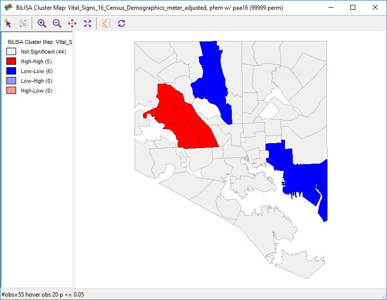
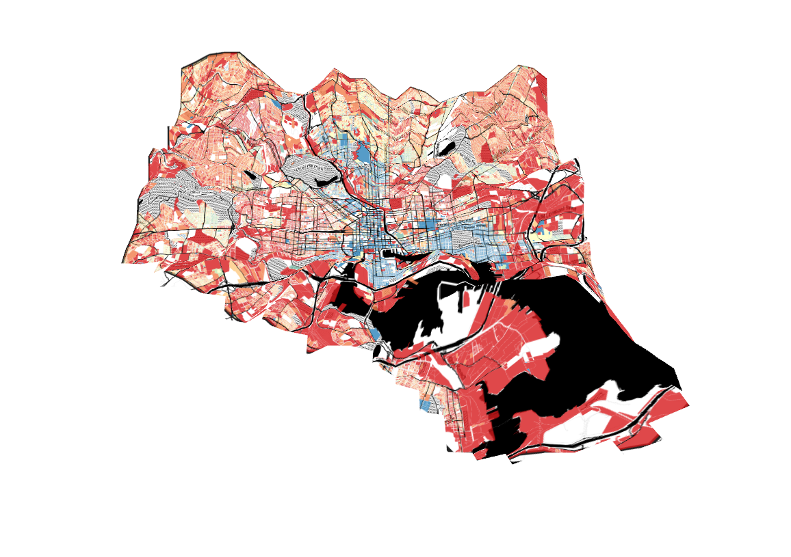

{: .align-left width="120px"}
My name is DW Rowlands.  I am a visiting lecturer in chemistry at the [University of Maryland, Baltimore County](https://www.umbc.edu) and I write about urban planning, transportation, and local history topics for [Greater Greater Washington](https://ggwash.org/drowlands).  

This site is a portfolio of projects I've created for [GES 687, "Advanced Applications of Geographic Information Systems,"](http://catalog.umbc.edu/preview_course_nopop.php?catoid=17&coid=51285) at UMBC. 

------

#### [Cluster Analysis Lab](ClusterAnalysisLab/ClusterAnalysisLab.html)

{: .align-left width="240px"}
A bivariate local Moran's I spatial correlation analysis map showing the high correlation between the fraction of African-American residents in neighborhoods and the fraction of female residents (a proxy for rates of incarceration of residents) in those same neighborhoods.  It was produced for Lab 6 in GES 687 during the Fall 2018 semester at UMBC.

------

#### [Population Distribution and Race](DC_Pop_Dist/DC_Pop_Dist.html)

{: .align-left width="240px"}
Map of the population distribution in the DC metro area, 1970-2016. One dot per ten residents, colored blue for whites, green for African-Americans, orange for Latinx, and red for Asian-Americans (and others). The large dots are the center-of-population for each racial group within the study region.  It was produced for Project 2 in GES 687 during the Fall 2018 semester at UMBC.

------

#### [Property Values and Transit](Baltimore-Property-Values-and-Transit/Baltimore-Property-Values-and-Transit.html)

{: .align-left width="240px"}
This 3D map of of Baltimore City shows distance from transit as elevation and value per square meter of private real property as color, with bluer colors indicating higher values. It was produced for Project 1 in GES 687 during the Fall 2018 semester at UMBC.

------

#### [Baltimore Housing Market Typology](Baltimore-MVA/Baltimore-MVA.html)

&nbsp;
{: .align-left width="240px"}
This map of [Baltimore's Housing Market Typology](https://planning.baltimorecity.gov/maps-data/housing-market-typology) shows real property in Baltimore color-coded by use and market conditions.  It was produced for Lab 1 in GES 687 during the Fall 2018 semester at UMBC.

&nbsp;
&nbsp;
&nbsp;
&nbsp;
&nbsp;
&nbsp;
&nbsp;
&nbsp;
&nbsp;
&nbsp;
&nbsp;
&nbsp;
&nbsp;
&nbsp;
&nbsp;
&nbsp;
&nbsp;

------

#### [DC-area Place Names](SampleProject/CDPs.html)

{: .align-left width="240px"}
I made this map of [Census-designated places](https://en.wikipedia.org/wiki/Census-designated_place) and municipalities in the DC area for [a Greater Greater Washington article](https://ggwash.org/view/63487/where-you-live-is-important-but-around-here-its-not-that-easy-to-define) in June 2017.

